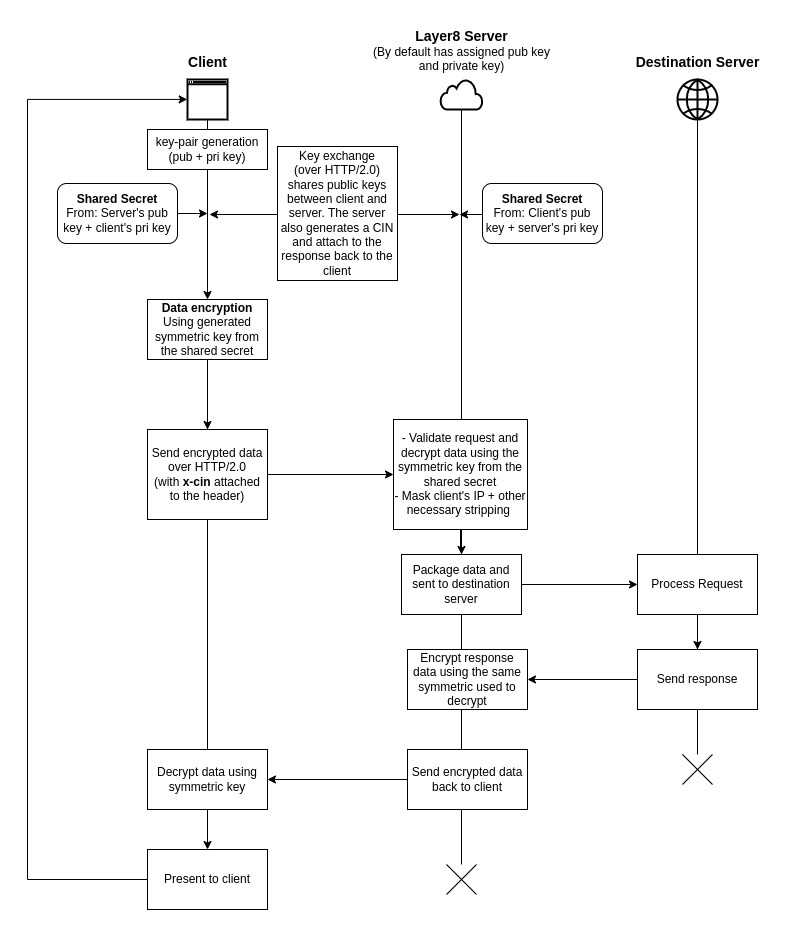

# layer8-genesis-repo
This repo contains the elementary component implementations to make the Layer8 system work: symmetric encryption, asymmetric key exchanges, OAuth flow, etc.

It was intended for the data transfer between clients and the Layer8 server to be over HTTP/2 using gRPC, but due to browser limitations, the data transfer will be over HTTP/1.1 using REST (at least for now until a way around [gRPC-Web](https://github.com/grpc/grpc-web) is found).

## Dependencies
- [Go](https://golang.org/doc/install)
- [Python 3](https://www.python.org/downloads/) (for the example client)
- [Make](https://www.gnu.org/software/make/)
- [golangci-lint](https://golangci-lint.run/usage/install/#local-installation)

## Setup
- Execute `make setup` to install the dependencies

## Build
- Execute `make build` to build the binaries

## Run
- Execute `make run` to run the server

## Testing
- Execute `make test` to run the unit tests

## Linting
- Execute `make lint` to run the linter

## Formatting
- Execute `make fmt` to run the formatter

## Flow Diagram

