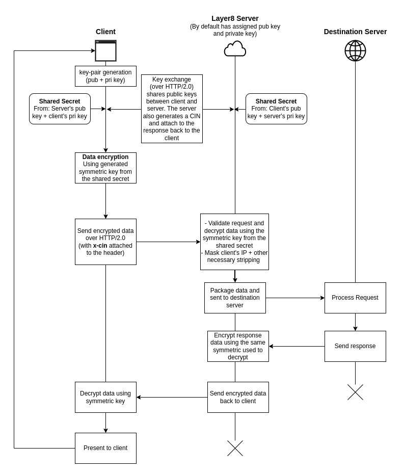
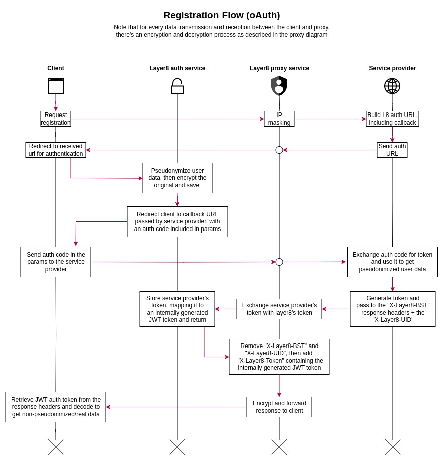
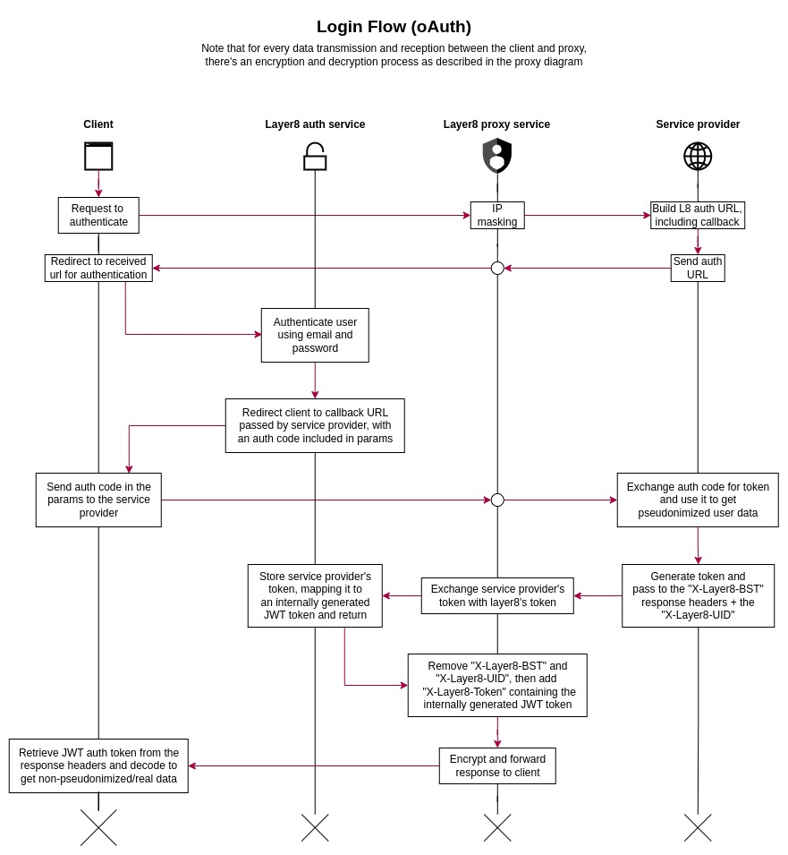
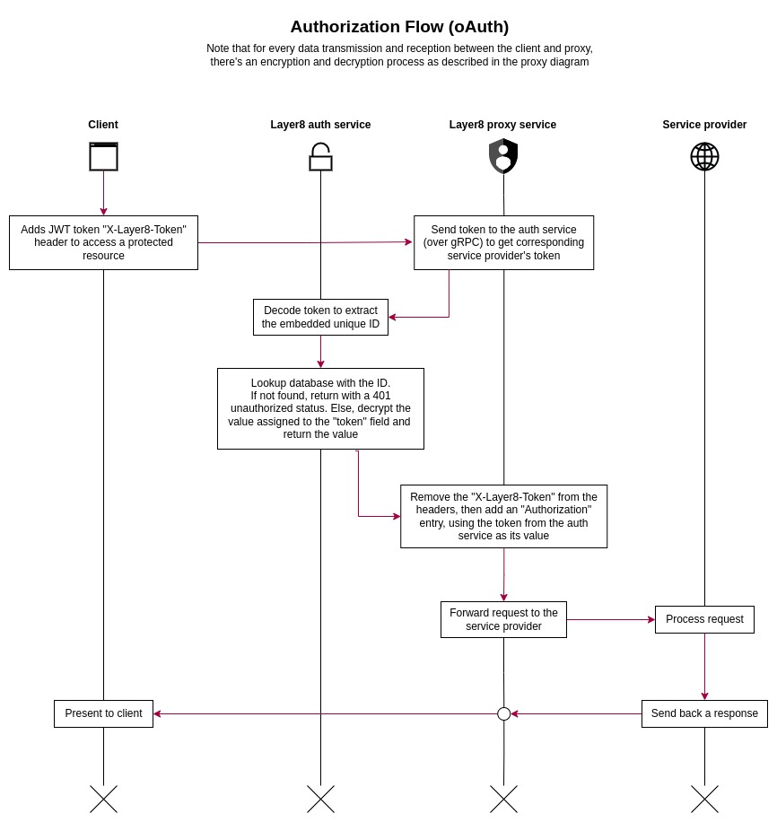

# The Layer8 System

## Table of Contents
- [The Layer8 System](#the-layer8-system)
  - [Table of Contents](#table-of-contents)
  - [Introduction](#introduction)
  - [Design](#design)
    - [The Layer8 Client](#the-layer8-client)
    - [The Layer8 Proxy Service](#the-layer8-proxy-service)
    - [The Layer8 Auth Service](#the-layer8-auth-service)
      - [Authentication](#authentication)
      - [Authorization](#authorization)
  - [Conclusion](#conclusion)

---

## Introduction
Backend systems as we know are complex. To develop a system that focuses on the anonymity of users, it is highly imperative that the Layer8 system is very secure and designed in a way that makes it easy to integrate into any kind of system. This document will describe the design of the Layer8 system, and how it is designed to be flexible, and allow for easy integration into existing or new systems.

The Layer8 system is a system that anonymizes user identities, replacing them with pseudonyms, and making it impossible to link or track users. Every collected data is encrypted, and can only be decrypted by the user who owns the data. The system is designed to be modular, and consists of several components that work together to provide the functionality of the system.

---

## Design
The Layer8 system consists of three main components: [the Layer8 client](#the-layer8-client), [the Layer8 auth service](#the-layer8-auth-service), and [the Layer8 proxy service](#the-layer8-proxy-service)

### The Layer8 Client
The Layer8 client is written in Golang and compiled to a WASM binary that is executed in the browser. It is responsible for encrypting and decrypting data, and communicating with the Layer8 proxy service. It works by providing a `layer8.fetch` function that is used to make requests to the service provider. Using the `layer8.fetch` function, the client collects the request object, encrypts the body, and sends it to the Layer8 proxy service. The response from the backend service is then encrypted by the proxy service and sent back to the Layer8 client, which then decrypts it and presents it to the caller. An example of the `layer8.fetch` function usage is shown below:

```js
const response = await window.layer8.fetch({
  method: 'POST',
  url: 'https://example.com/api/v1/users',
  body: {
    name: 'John Doe',
    email: 'john@doe.com',
    password: 'password'
  }
});
```

The `fetch` function returns a promise that resolves to the response from the backend service. The response object has the following properties:

- `status`: The HTTP status code of the response
- `statusText`: The HTTP status text of the response
- `headers`: The HTTP headers of the response
- `body`: The body of the response

### The Layer8 Proxy Service
The Layer8 proxy service is responsible for proxying requests from the Layer8 client to the actual backend service, and vice versa. It is also responsible for encrypting and decrypting data. The flow of data between the Layer8 client and the Layer8 proxy service is shown in the diagram below:



### The Layer8 Auth Service
The Layer8 auth service is responsible for authenticating users, pseudonymizing their identities, generating and storing their keys. To facilitate integration, oAuth2 is adopted as the authentication mechanism.

Before the authentication process begins, the backend service must be registered with the Layer8 auth service. With this, the backend service will be provided with a client ID and client secret that will be used to authenticate the backend service with the Layer8 auth service.

#### **Authentication**
First, the backend service must provide the client with the Layer8's authorization URL, including the client ID and a callback URL. The client will then be redirected to the authorization URL, where they will be required to login and grant the backend service access to their data (pseudonymized). If the user grants the backend service access to their data, the Layer8 auth service will redirect the user to the redirect URL, including an authorization code in the query string. This authorization code will be a time-limited code, and is the result of two layers of encryption:

- The first layer of encryption is the encryption of the user's password with Layer8's public key.
- The second layer of encryption is the encryption of the result of the first layer of encryption + an expiration timestamp with the backend service's public key.

The backend service will then use the authorization code to request an access token from the Layer8 auth service. Internally, the Layer8 auth service will decrypt the authorization code using the backend service's secret/private key, and then check if the expiration timestamp is valid. If the expiration timestamp is valid, the Layer8 auth service will then store the first layer of encryption (the user's password encrypted with Layer8's public key)in the database, referenced by the user's ID (note that this will be deleted after a certain period of time and can only be used once). The Layer8 auth service will then generate an access token, which will be used to authenticate the backend service with the Layer8 auth service, to retrieve the user's pseudonymized data. 

The access token will be returned to the backend service, which can be used to authenticate with the Layer8 auth service to retrieve the user's pseudonymized data. In the data, the Layer8 auth service will also include the user's ID. This ID should be added to the response headers of the backend service, so that the Layer8 proxy service can use it to retrieve the user's encrypted password from the database, which will be used to decrypt the user's original data to be added to a JWT token, which will be returned to the Layer8 client in-place of the token returned by the backend service. The backend service's token will be saved in the database and identified by a unique ID generated for the JWT token of the user. An example of the response headers is shown below:

```http
X-Layer8-UID: 1234567890
X-Layer8-BST: <backend_service_token>
```

> Before the Layer8 proxy service returns the response to the Layer8 client, it will remove the `X-Layer8-UID` and `X-Layer8-BST` headers from the response, then add the `X-Layer8-Token` header, which will contain the JWT token.

*During registration*, the user is required to provide their information (name, email, password, etc.) This information is pseudonymized and stored in the database. A key pair will be generated and the public key will be used to encrypt the original information, while the private key will be encrypted using the user's password and stored in the database. The user's password will be used to decrypt the private key when needed. An authorization code will be generated following the same process as described above, and returned to the backend service. Below is a diagram showing the flow of data during registration:



*During login*, the user will provide their email and password. The Layer8 auth service will then retrieve the user with email and compare the provided password with the stored password. If the passwords match, the Layer8 auth service will generate an authorization code following the same process as described above, and return it to the backend service. Below is a diagram showing the flow of data during login:



#### **Authorization**
The Layer8 auth service is also responsible for authorizing users. To authorize a user, the auth service use the unique ID embedded in the JWT token to retrieve the backend service token from the database. The backend service token is then used to access protected resources on the backend service on behalf of the user. The backend service token is deleted immediately the 401 response is received from the backend service or the user logs out or re-authenticates. Attached below is a diagram showing the flow of data during authorization:



---

## Conclusion
The Layer8 system consists of three main components: the Layer8 client, the Layer8 auth service, and the Layer8 proxy service. The Layer8 client is responsible for encrypting and decrypting data, and communicating with the Layer8 proxy service. The Layer8 proxy service is responsible for proxying requests from the Layer8 client to the actual backend service, and vice versa. It is also responsible for encrypting and decrypting data. The Layer8 auth service is responsible for authenticating users, pseudonymizing their identities, generating and storing their keys. To facilitate integration, oAuth2 is adopted as the authentication mechanism.
